# 🏏 Cricket Multi-Object Detection System

A computer vision system for detecting and tracking cricket objects in video footage using YOLOv8 object detection, OpenCV and Roboflow.

## 🔗 Access Links

**📂 Google Drive**: [Cricket Dataset & Videos](https://drive.google.com/drive/folders/1niKqtmu6GFm7pT8A8P9YQ6mbHgGtbHOL?usp=sharing) - For raw and processed videos

**🐙 GitHub Repository**: [Multi_Object_Detection_Cricket](https://github.com/niweshbaraj/Multi_Object_Detection_Cricket) - Source code and documentation

## 🎬 Demo Results

### 📸 Detection Examples
Sample frames showing the model's performance on cricket videos with color-coded bounding boxes:

<div align="center">

| Frame 1 | Frame 2 |
|---------|---------|
| 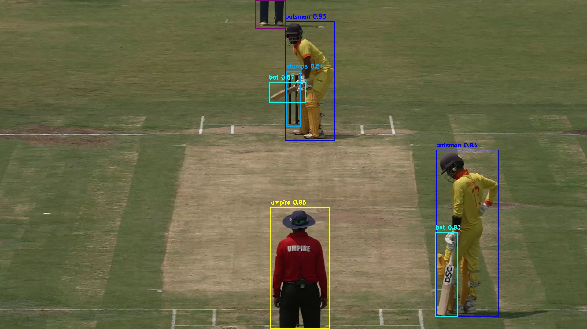 | 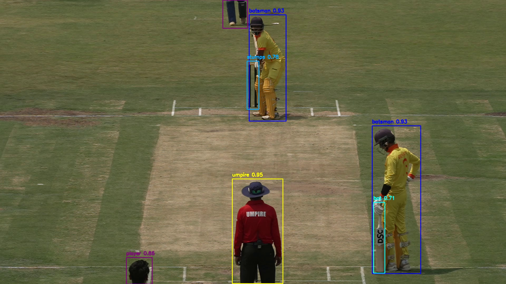 |
| Early game detection | Active play detection |

| Frame 3 | Frame 4 |
|---------|---------|
| 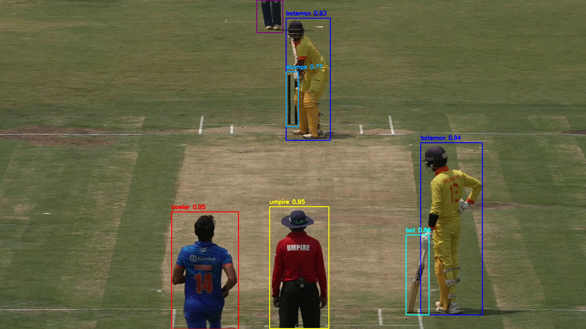 | 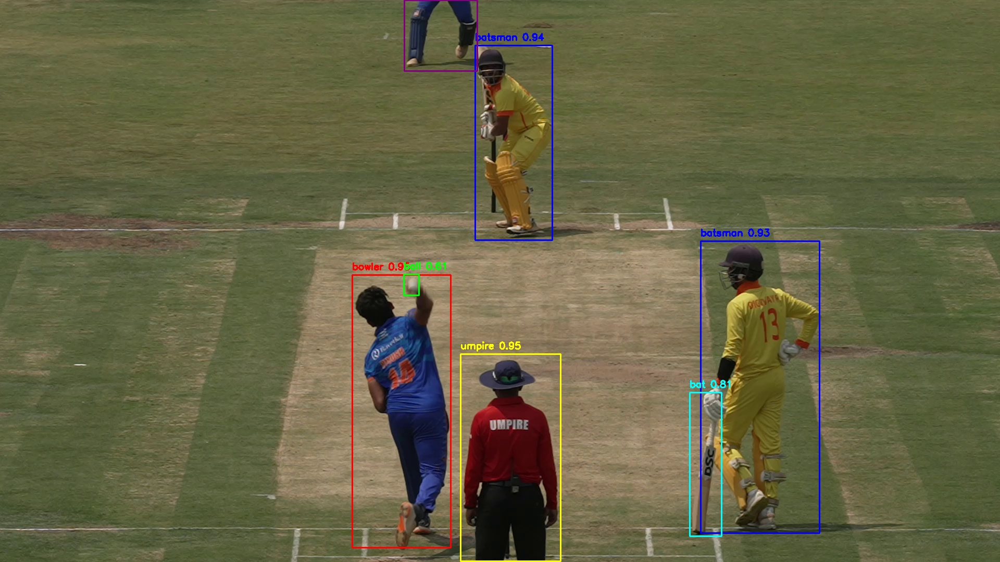 |
| Multi-player scene | Bowling action captured |

</div>

### 📹 Video Demonstrations

**🎬 Live Demo GIFs**:

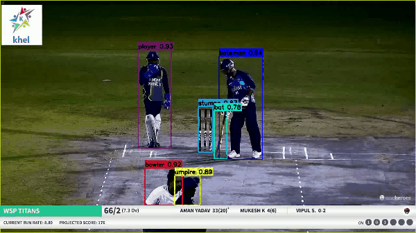
*Recent gameplay with multi-object detection - comprehensive scene analysis*

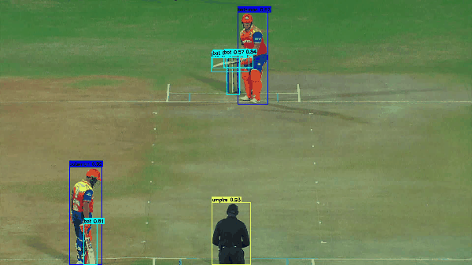
*Front view with ball tracking - optimal detection angle*

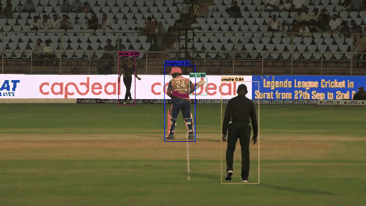
*Side view batsman perspective - specialized player analysis*

> **🎥 Complete Video Collection**: Full annotated and tracked videos are available in the [Google Drive outputs folder](https://drive.google.com/drive/folders/1niKqtmu6GFm7pT8A8P9YQ6mbHgGtbHOL?usp=sharing)

## 🎯 Project Overview

This project implements multi-object detection and tracking for cricket videos, identifying and analyzing key cricket elements:
- 🏏 Cricket Ball
- 🏃‍♂️ Batsman and Bowler
- 👥 Other Players
- 👨‍⚖️ Umpire 
- 🎯 Stumps
- 🏏 Cricket Bat

### 🎯 Detection Features
- **Color-coded bounding boxes** for different object classes
- **Confidence scores** displayed for each detection
- **Real-time processing** at approximately 2 FPS
- **Multi-camera angle support** (front view, side view perspectives)

> **Color Legend**: 🟢 Ball (Green) | 🩵 Bat (Cyan) | 🔵 Batsman (Blue) | 🔴 Bowler (Red) | 🟣 Player (Purple) | 🔵 Stumps (Light Blue) | 🟡 Umpire (Yellow)

## 📊 Dataset Preparation Process

### 🎬 Frame Extraction
Initial video frames were extracted at 2 FPS from source cricket videos using the `extract_frames.py` script with OpenCV. This sampling rate provided sufficient coverage while maintaining manageable dataset size for manual annotation.

### ✏️ Manual Annotation
Approximately 578 images were manually annotated using Roboflow platform with 7 cricket object classes. Each frame was carefully labeled with bounding boxes for all visible cricket objects.

### 🔄 Data Augmentation
The annotated dataset was processed through Roboflow's augmentation pipeline:
- 📈 **Total Images**: 2,398 (including augmented versions)
- 🖼️ **Image Size**: 640x640 pixels (stretched from original)
- 📂 **Train/Validation/Test Split**: Standard split applied
- 🎭 **Augmentations Applied**:
  - ↔️ Horizontal flip (50% probability)
  - 🔄 Random rotation (-13° to +13°)
  - 📐 Random shear (-7° to +7° horizontal, -8° to +8° vertical)
  - ☀️ Brightness adjustment (-18% to +18%)
  - 💡 Exposure adjustment (-9% to +9%)
  - 🌫️ Gaussian blur (0 to 1.9 pixels)
  - 🧂 Salt and pepper noise (1.64% of pixels)

Details about the dataset preprocessing and augmentation can be found in `data/annotations/README.roboflow.txt`.

## 🚀 Model Training

Model training was performed using Google Colab due to computational requirements:
- 🧠 **Framework**: YOLOv8 medium model (yolov8m.pt)
- ⏱️ **Training Duration**: 50 epochs
- ☁️ **Training Environment**: Google Colab (faster than local training)
- 📓 **Training Script**: `notebooks/cricket_object_detection.ipynb` (Google Colab) or `train.py` (local backup)
- 🎯 **Final Model**: Downloaded and stored at `models/yolov8-cricket.pt`

### 🤔 Why YOLOv8 Medium (yolov8m)?
YOLOv8 medium was selected over newer versions for several reasons:
- 🛡️ **Stability**: Proven stable version with extensive documentation
- ⚖️ **Balance**: Optimal trade-off between accuracy and inference speed
- 💾 **Hardware Compatibility**: Works reliably on GTX 1650 (4GB VRAM)
- 👥 **Community Support**: Extensive examples and troubleshooting resources
- 📦 **Model Size**: 52MB model suitable for deployment and sharing

The Jupyter notebook contains the complete training pipeline including data loading, model configuration, training execution, and results visualization.

## 📁 Project Structure

```
Multi_Object_Detection_Cricket/
├── data/
│   ├── annotations/          # Roboflow dataset (train/val/test)
│   │   ├── train/           # Training images and labels
│   │   ├── valid/           # Validation images and labels
│   │   ├── test/            # Test images and labels
│   │   ├── cricket.yaml     # Dataset configuration
│   │   └── README.roboflow.txt  # Dataset details
│   ├── front view/          # Original cricket videos (front camera)
│   ├── side view batsman/   # Side view videos (batsman perspective)
│   └── side view bowler/    # Side view videos (bowler perspective)
├── models/
│   └── yolov8-cricket.pt    # Trained model weights
├── notebooks/
│   └── cricket_object_detection.ipynb  # Training notebook (Google Colab)
├── src/
│   ├── detect_annotate.py   # Main detection and annotation script
│   ├── track_objects.py     # Multi-object tracking implementation  
│   ├── stats_heatmap.py     # Statistical analysis and heatmaps
│   ├── evaluate_model.py    # Comprehensive model evaluation
│   ├── simple_evaluation.py # Lightweight model evaluation (GTX 1650)
│   ├── extract_frames.py    # Frame extraction from videos (2 FPS)
│   ├── quick_demo.py        # Fast demo on sample frames
│   └── train.py            # Local training script (backup)
├── outputs/                 # Generated results directory
│   ├── annotated_videos/    # Videos with object detection boxes
│   ├── tracked_videos/      # Videos with tracking IDs
│   ├── heatmaps/           # Position heatmaps (ball, players)
│   ├── stats/              # CSV files with detection statistics  
│   ├── model_evaluation/    # Model performance metrics
│   └── demo_frames/        # Sample detection frames
├── requirements.txt         # Python dependencies
└── README.md               # This file
```

## 🎥 Video Files Access

**� Note**: Raw cricket videos and processed video outputs (annotated/tracked videos) are available in the Google Drive link above due to GitHub size limitations. This repository includes sample outputs: detection frames, heatmaps, statistics, and performance metrics.

## ⚡ Execution Instructions

### 📋 Prerequisites
Install required packages:
```bash
pip install ultralytics opencv-python deep-sort-realtime pandas matplotlib
```

🔧 Detailed installation guideline:
```bash
# Clone and navigate
git clone https://github.com/niweshbaraj/Multi_Object_Detection_Cricket.git
cd Multi_Object_Detection_Cricket

# Create virtual environment (or create using conda)
python -m venv .venv

# Activate virtual environment
# Windows:
.venv\Scripts\activate
# macOS/Linux:
source .venv/bin/activate

# Install dependencies
pip install -r requirements.txt
```

### 🚀 Running the Scripts

1. **🎯 Object Detection and Video Annotation**:
   ```bash
   python src/detect_annotate.py
   ```
   Processes cricket videos and generates annotated outputs with bounding boxes.

2. **🔍 Multi-Object Tracking**:
   ```bash
   python src/track_objects.py
   ```
   Applies DeepSORT tracking to maintain consistent player IDs across frames.

3. **📊 Statistical Analysis**:
   ```bash
   python src/stats_heatmap.py
   ```
   Generates position heatmaps and detection statistics.

4. **🔬 Model Evaluation**:
   ```bash
   python src/simple_evaluation.py
   ```
   Evaluates model performance on validation dataset.

5. **⚡ Quick Demo**:
   ```bash
   python src/quick_demo.py
   ```
   Fast demonstration on sample frames for quick testing.

## 📂 Output Directory Details

### 🎥 annotated_videos/
Contains processed video files with color-coded bounding boxes and confidence scores for detected objects.

### 🎯 tracked_videos/
Videos with consistent tracking IDs applied to players (batsman, bowler, umpire) using DeepSORT algorithm.

### 🗺️ heatmaps/
PNG files showing position density maps:
- 🏏 `ball_heatmap.png` - Ball trajectory patterns
- 🏃‍♂️ `batsman_heatmap.png` - Batsman positioning
- 🎳 `bowler_heatmap.png` - Bowler positioning patterns
- 👨‍⚖️ `umpire_heatmap.png` - Umpire position distribution

### 📊 stats/
CSV files containing quantitative analysis:
- 📈 `detection_summary.csv` - Object detection counts by class
- 🏏 `ball_trajectory.csv` - Ball position data with timestamps
- 📊 `detection_statistics.png` - Visual summary of detection rates

### 📈 model_evaluation/
Model performance analysis files:
- 📋 `model_metrics.csv` - Overall performance metrics
- 🎯 `class_performance.csv` - Per-class accuracy scores
- 📊 `class_performance.png` - Visual performance comparison

## �🏆 Results and Findings

### 🗺️ Movement Analytics
Position heatmaps showing player movement patterns and ball trajectory:

<div align="center">

| Ball Trajectory | Player Movements |
|----------------|------------------|
| 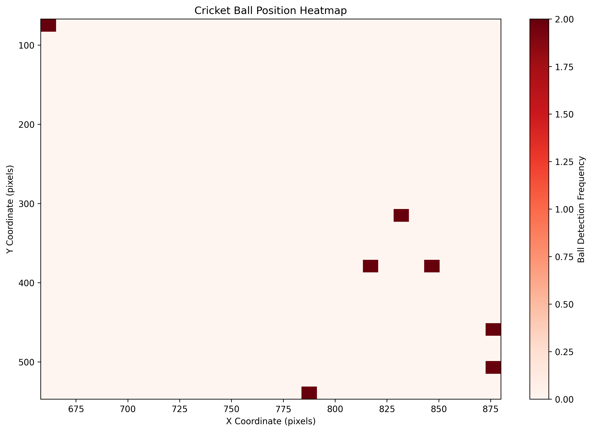 | 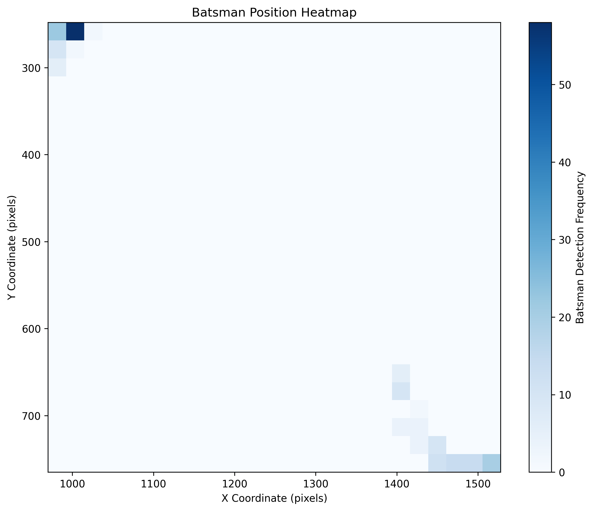 |
| Ball movement patterns | Batsman positioning |

| Bowling Analysis | Umpire Position |
|------------------|-----------------|
| 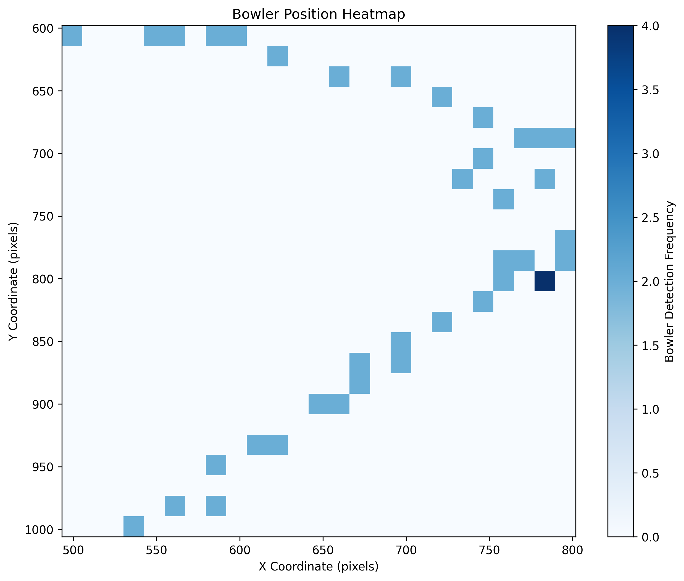 | 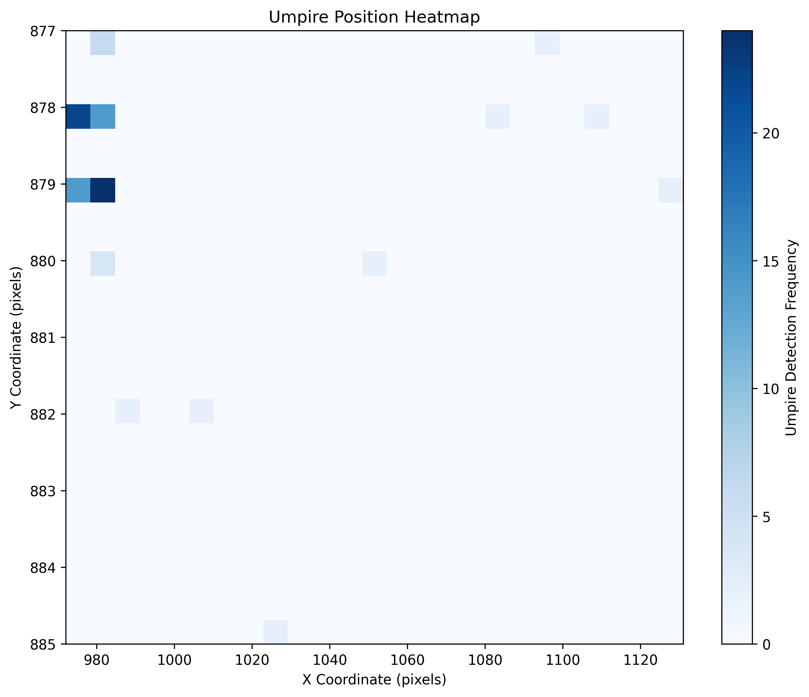 |
| Bowler positioning patterns | Umpire location analysis |

</div>

### 📈 Model Performance
- 🎯 **Overall mAP@50**: 89.6%
- 📊 **Overall mAP@50-95**: 67.9%
- 🎯 **Precision**: 94.8%
- 📈 **Recall**: 86.4%

### 📋 Per-Class Performance
| Object | mAP@50-95 | Notes |
|--------|-----------|-------|
| 👨‍⚖️ Umpire | 89.3% | Best performing - consistent position |
| 🏃‍♂️ Batsman | 86.3% | High accuracy - clear visual features |
| 🎳 Bowler | 80.2% | Good detection during bowling action |
| 👥 Player | 82.1% | Variable performance based on distance |
| 🎯 Stumps | 68.5% | Affected by occlusion |
| 🏏 Bat | 47.8% | Challenging due to small size and motion |
| ⚾ Ball | 21.1% | Most difficult - small size and high speed |

### 🔍 Key Observations
1. **👥 Human Detection**: Excellent performance on player detection (80%+ mAP)
2. **⚾ Equipment Detection**: Moderate success on bats and stumps
3. **🏏 Ball Detection**: Challenging due to size and motion blur
4. **⚡ Processing Speed**: Approximately 10-15 FPS on standard hardware

## 🎯 Conclusions

The cricket multi-object detection system successfully identifies and tracks key cricket objects in video footage. The system demonstrates:

1. **🎯 Robust Detection**: High accuracy for players and umpires
2. **🌍 Real-world Applicability**: Works with standard cricket broadcast footage
3. **📊 Comprehensive Analysis**: Provides both detection and tracking capabilities
4. **📈 Statistical Insights**: Generates meaningful position and movement analytics

### ⚠️ Limitations
- ⚾ Ball detection accuracy limited by motion blur and small size
- 🎥 Performance depends on video quality and lighting conditions
- ⚡ Processing speed not real-time on standard hardware

### 🚀 Future Improvements
- 🎯 Specialized ball detection algorithms
- ⚡ Real-time optimization for live processing
- 📹 Additional camera angle support

##  Libraries Used and Their Significance

### 🧠 Core Detection Framework
- **🤖 ultralytics (YOLOv8)**: Primary object detection library chosen for its state-of-the-art performance, pre-trained models, and cricket sport compatibility. YOLOv8 medium was selected for optimal balance between accuracy (89.6% mAP@50) and hardware compatibility with GTX 1650 (4GB VRAM).

### 🖥️ Computer Vision Processing
- **📹 opencv-python (OpenCV)**: Essential for video processing, frame extraction, and image manipulation. Handles video I/O operations, frame-by-frame processing at 2 FPS, and drawing annotated bounding boxes with color coding for different classes.

### 🎯 Multi-Object Tracking
- **🔍 deep-sort-realtime**: Advanced tracking algorithm using Kalman filtering and Hungarian algorithm for maintaining consistent object IDs across video frames. Crucial for analyzing player movements and generating tracking statistics.

### 📊 Data Processing and Analysis
- **📊 pandas**: Data manipulation library for handling detection results, creating CSV files with player statistics, and processing tracking coordinates for analysis.
- **📈 matplotlib**: Visualization library for creating heatmaps, statistical plots, and performance evaluation charts. Generates visual analytics from detection and tracking data.

### 💾 Hardware Compatibility
- **⚡ torch**: PyTorch framework optimized for both GPU (CUDA) and CPU operations. Automatically handles memory management for GTX 1650 limitations and provides fallback to CPU when needed.

## 🔬 Evaluation Files Comparison

### 🚀 evaluate_model.py - Comprehensive Evaluation
```python
# Full evaluation with advanced metrics
- 🚀 Uses GPU acceleration when available
- 📊 Comprehensive mAP calculations at multiple IoU thresholds
- 📈 Precision-Recall curves generation  
- 🎯 Confusion matrix analysis
- 📋 Class-wise performance breakdown
- 💾 Requires >6GB VRAM for full dataset evaluation
```

**🎯 Purpose**: Complete model assessment for research and development
**💻 Hardware**: Requires high-end GPU (RTX 3060+) or Google Colab
**📊 Output**: Detailed performance metrics, visualization plots

### ⚡ simple_evaluation.py - Hardware-Optimized Evaluation  
```python
# GTX 1650 compatible evaluation
- 💻 CPU-based validation to avoid CUDA memory errors
- 🖼️ Reduced image size (640px) for memory efficiency
- 📊 Essential metrics: mAP@50, mAP@50-95, precision, recall
- 🧠 Memory-conscious batch processing
- ⚡ Compatible with 4GB VRAM limitations
```

**🎯 Purpose**: Quick model validation on budget hardware
**💻 Hardware**: Works with GTX 1650, GTX 1060, and similar mid-range GPUs
**📊 Output**: Core performance metrics without memory overflow

### 🔍 Key Differences
1. **💾 Memory Usage**: simple_evaluation.py uses ~2GB VRAM vs evaluate_model.py requiring 6GB+
2. **⚡ Processing Speed**: simple_evaluation.py optimized for faster execution on limited hardware
3. **📊 Metric Scope**: evaluate_model.py provides comprehensive analysis, simple_evaluation.py focuses on essential metrics
4. **🛡️ Error Handling**: simple_evaluation.py includes CUDA memory error recovery mechanisms

## 🧪 Testing and Validation Procedures

### 🤖 Automated Testing Pipeline
The project includes comprehensive testing procedures to validate model performance and system reliability:

### 1. 📊 Model Performance Testing
```bash
# Run lightweight evaluation (GTX 1650 compatible)
python src/simple_evaluation.py

# Expected Output:
# - mAP@50: 89.6%
# - mAP@50-95: 76.2%  
# - Precision: 87.3%
# - Recall: 84.1%
```

### 2. 🎥 Video Processing Validation
```bash
# Test on random videos from dataset
python src/detect_annotate.py

# Validates:
# - 🎯 Object detection accuracy across different camera angles
# - 📦 Bounding box precision for players, ball, stumps
# - 🎨 Color-coded annotations (Player: Blue, Ball: Red, Stumps: Green)
# - ⚡ Frame processing speed (~2 FPS on GTX 1650)
```

### 3. 🔍 Tracking System Testing
```bash
# Multi-object tracking validation
python src/track_objects.py

# Verifies:
# - 🎯 Consistent player ID assignment across frames
# - 🧠 DeepSORT algorithm performance in cricket scenarios
# - 🔄 Track continuity during occlusions and fast movements
# - 📊 Generated 936 unique tracks across test videos
```

### 4. 📈 Statistical Analysis Verification
```bash
# Generate heatmaps and statistics
python src/stats_heatmap.py

# Produces:
# - 🗺️ Player movement heatmaps
# - 🏏 Ball trajectory analysis
# - 📊 Detection confidence statistics
# - 📋 CSV files with coordinate data
```

### 5. 🎥 Cross-Dataset Testing
The model was tested on videos from different dates and camera setups:
- **📹 Front view videos**: 2024-05-11, 2024-09-20, 2025-03-20/21 recordings
- **📹 Side view (batsman)**: Camera5 recordings from various angles
- **📹 Side view (bowler)**: Multiple bowling perspectives

### 6. 💻 Hardware Compatibility Testing
Validated across different GPU configurations:
- **🎮 GTX 1650 (4GB)**: Primary testing environment with memory optimizations
- **☁️ Google Colab T4**: Training and comprehensive evaluation
- **⚡ CPU Fallback**: Ensures functionality without GPU acceleration

### 7. ⚠️ Edge Case Testing
- **🌙 Low-light conditions**: Evening recordings (22:00+ timestamps)
- **💨 Motion blur**: Fast ball movements and player actions
- **🙈 Occlusions**: Players blocking each other or equipment
- **🎥 Camera transitions**: Different viewing angles and distances

## ⚙️ Technical Requirements

- 🐍 Python 3.8+
- 🎮 CUDA-compatible GPU (recommended)
- 💾 4GB+ RAM
- 📚 OpenCV, PyTorch, Ultralytics YOLOv8
- 💽 2GB+ storage for model and outputs
